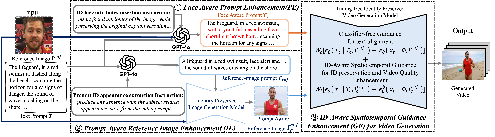

<p align="center">

<h1 align="center">Identity-Preserving Text-to-Video Generation via Training-Free Prompt, Image, and Guidance Enhancement</h1>
<p align="center">
    <strong>Jiayi Gao<sup>*</sup></strong>
    ·
    <strong>Changcheng Hua<sup>*</sup></strong>
    ·
    <strong>Qingchao Cheng</strong>
    ·
    <strong>Yuxin Peng</strong>
    ·
    <strong>Yang Liu</strong><sup>&dagger;</sup>
</p>


## Introduction
Specifically, we first propose \textit{\ding{192}Face Aware Prompt Enhancement}, using GPT-4o to enhance the text prompt with facial details derived from the reference image. We then propose Prompt Aware Reference Image Enhancement,  leveraging an identity-preserving image generator to refine the reference image, rectifying conflicts with the text prompt. The above mutual refinement significantly improves input quality before video generation. Finally, we propose ID-Aware Spatiotemporal Guidance Enhancement, utilizing an unified gradients to optimize identity preservation and video quality jointly during generation.
Our method outperforms prior work and is validated by automatic and human evaluations on a 1000-video test set—winning first place in the ACM Multimedia 2025 Identity-Preserving Video Generation Challenge, demonstrating state-of-the-art performance and strong generality. 




<!-- ## 🎉 News
- [x] May 14, 2025: 🔥Wan2.1-VACE-1.3B and Wan2.1-VACE-14B models are now available at [HuggingFace](https://huggingface.co/Wan-AI/Wan2.1-VACE-14B) and [ModelScope](https://www.modelscope.cn/models/Wan-AI/Wan2.1-VACE-14B)!
- [x] Mar 31, 2025: 🔥VACE-Wan2.1-1.3B-Preview and VACE-LTX-Video-0.9 models are now available at [HuggingFace](https://huggingface.co/collections/ali-vilab/vace-67eca186ff3e3564726aff38) and [ModelScope](https://modelscope.cn/collections/VACE-8fa5fcfd386e43)!
- [x] Mar 31, 2025: 🔥Release code of model inference, preprocessing, and gradio demos. 
- [x] Mar 11, 2025: We propose [VACE](https://ali-vilab.github.io/VACE-Page/), an all-in-one model for video creation and editing. -->


# Base Model Information


| Models           | Download Link                                                                                                                                  | Video Size         | License                                                                           |
| ---------------- | ---------------------------------------------------------------------------------------------------------------------------------------------- | ------------------ | --------------------------------------------------------------------------------- |
| Wan2.1-VACE-1.3B | [Huggingface](https://huggingface.co/Wan-AI/Wan2.1-VACE-1.3B) 🤗     [ModelScope](https://www.modelscope.cn/models/Wan-AI/Wan2.1-VACE-1.3B) 🤖 | \~ 81 x 480 x 832  | [Apache-2.0](https://huggingface.co/Wan-AI/Wan2.1-T2V-1.3B/blob/main/LICENSE.txt) |
| Wan2.1-VACE-14B  | [Huggingface](https://huggingface.co/Wan-AI/Wan2.1-VACE-14B) 🤗     [ModelScope](https://www.modelscope.cn/models/Wan-AI/Wan2.1-VACE-14B) 🤖   | \~ 81 x 720 x 1280 | [Apache-2.0](https://huggingface.co/Wan-AI/Wan2.1-T2V-14B/blob/main/LICENSE.txt)  |


- Our method is proposed based on Wan2.1-VACE, please download your preferred base model to `<repo-root>/models/`. 


## ⚙️ Installation
The codebase was tested with Python 3.10.13, CUDA version 12.4, and PyTorch >= 2.5.1.

### Setup for Model Inference
You can setup for VACE model inference by running:
```bash
git clone https://github.com/ali-vilab/VACE.git && cd VACE
pip install torch==2.5.1 torchvision==0.20.1 --index-url https://download.pytorch.org/whl/cu124  # If PyTorch is not installed.
pip install -r requirements.txt
pip install wan@git+https://github.com/Wan-Video/Wan2.1  # If you want to use Wan2.1-based VACE.
```
## Data
We accomplish the validation experiments based on the [dataset](https://github.com/HiDream-ai/ipvg-challenge.github.io/releases/download/testset/vip200k_test_track_Facial.zip) provided by the challenge. Please download the dataset to `<repo-root>/data/`.

## Inference
To acquire the generated the video, please run:
```bash
sh run.sh
``` 
## Evaluation
Please check `<repo-root>/ID_eval_finals/`

<!-- 
### Setup for Preprocess Tools
If you need preprocessing tools, please install:
```bash
pip install -r requirements/annotator.txt
```
Please download [VACE-Annotators](https://huggingface.co/ali-vilab/VACE-Annotators) to `<repo-root>/models/`.

### Local Directories Setup
It is recommended to download [VACE-Benchmark](https://huggingface.co/datasets/ali-vilab/VACE-Benchmark) to `<repo-root>/benchmarks/` as examples in `run_vace_xxx.sh`.

We recommend to organize local directories as:
```angular2html
VACE
├── ...
├── benchmarks
│   └── VACE-Benchmark
│       └── assets
│           └── examples
│               ├── animate_anything
│               │   └── ...
│               └── ...
├── models
│   ├── VACE-Annotators
│   │   └── ...
│   ├── VACE-LTX-Video-0.9
│   │   └── ...
│   └── VACE-Wan2.1-1.3B-Preview
│       └── ...
└── ...
``` -->


## Acknowledgement

We are grateful for the following awesome projects, including [VACE](https://github.com/ali-vilab/VACE) and [Wan](https://github.com/Wan-Video/Wan2.1).


<!-- ## BibTeX

```bibtex
@article{vace,
    title = {VACE: All-in-One Video Creation and Editing},
    author = {Jiang, Zeyinzi and Han, Zhen and Mao, Chaojie and Zhang, Jingfeng and Pan, Yulin and Liu, Yu},
    journal = {arXiv preprint arXiv:2503.07598},
    year = {2025}
} -->